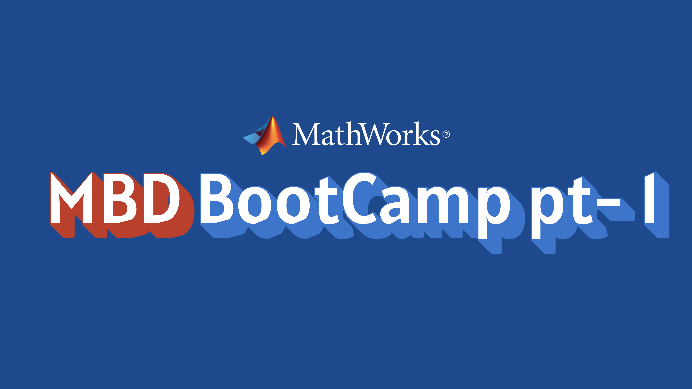
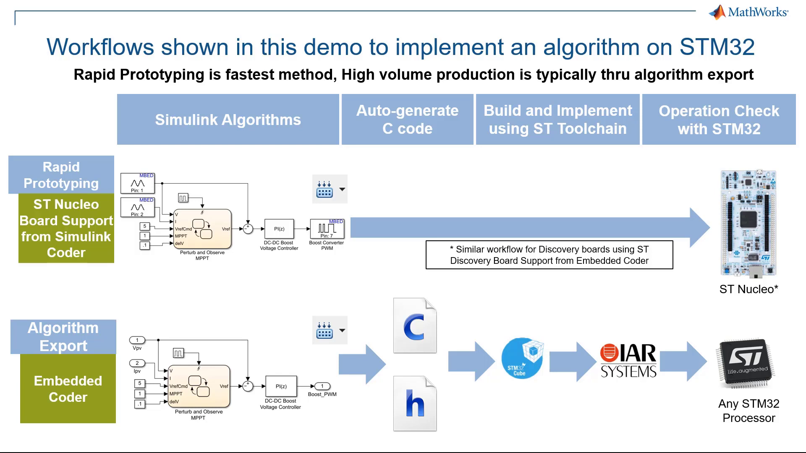

# ⚙️ MBD Bootcamp — Model-Based Design & Algorithm Export

A hands-on **Model-Based Design (MBD) Bootcamp** focused on bridging the gap between rapid algorithm prototyping and **production-ready algorithm export** for embedded systems.

This repository contains the models, examples, and progressive implementation steps used throughout the bootcamp. The development history is intentionally maintained through incremental Git commits so that each stage of the implementation can be followed alongside the corresponding video.

> **🚧 Status:** This playlist and repository are still in progress.
> Pull the latest changes regularly to follow the most up-to-date version of the material.

---

## 📚 About the Bootcamp

The **MBD Bootcamp** is a technical tutorial series designed to demonstrate how algorithms developed during the prototyping stage can be progressively transformed into code suitable for embedded deployment.

The series focuses on practical Model-Based Design workflows using **MATLAB/Simulink**, with examples oriented toward **motor control and power electronics** applications.

The main objective is to understand not only how to build and simulate an algorithm, but also how to prepare that algorithm for reliable and maintainable **code generation and embedded integration**.

### 🔧 Topics Covered

* Continuous and discrete-time modeling
* Solver configuration and model execution
* Lookup table implementation
* Model configuration for code generation
* Atomic Subsystems
* C-function identifier customization
* Code generation configuration
* File and code packaging
* Preparing generated code for embedded targets
* Transitioning from algorithm prototypes to production-oriented implementations

---

# 🗺️ Bootcamp Roadmap

## 1️⃣ Part 1 — Model-Based Design Fundamentals

The first stage introduces the fundamentals required to build and understand an MBD workflow.

Topics include:

* Model construction
* Continuous vs. discrete systems
* Sample times
* Solver configuration
* Simulation behavior
* Basic algorithm implementation


 


---

## 2️⃣ Part 2 — Algorithm Implementation & Modeling

The second stage builds on the initial model and introduces practical implementation techniques.

Topics include:

* Discrete algorithm implementation
* Lookup tables
* Parameter configuration
* Model behavior and validation
* Preparing the algorithm for the next stage of the workflow

<div> <center>

</div>


---

## 3️⃣ Part 3 — From Model to Production-Ready Code

The third stage focuses on the transition from a simulation-oriented model to a model configured for **production-level code generation**.

Topics include:

* Atomic Subsystems
* Code generation configuration
* C-function identifier customization
* Function and file naming
* Code packaging
* Generated-code organization
* Preparing the model for embedded targets





---

# 🔀 Development Through Git Commits

NOTE : One of the main goals of this repository is to make the development process **traceable**.

Each significant step in the bootcamp is committed separately rather than uploading only the final implementation.

This allows you to:

1. Start from the initial implementation.
2. Follow each modification step by step.
3. Compare changes between commits.
4. Reproduce the exact state shown in the videos.
5. Experiment with the model without losing the original progression.

For the best learning experience, open the repository history and follow the commits while watching the corresponding video.

### 🧭 Recommended Workflow

```text
Clone Repository
       │
       ▼
Checkout Initial Commit
       │
       ▼
Watch Corresponding Video
       │
       ▼
Compare / Follow Changes
       │
       ▼
Move to Next Commit
       │
       ▼
Repeat
```

This approach is especially useful for understanding **why** a model changes at each stage, rather than simply looking at the final result.

---

# 🎥 Follow the Video Series

The complete tutorial series is available in the YouTube playlist:

**MBD Bootcamp — YouTube Playlist**

[▶️ Watch the MBD Bootcamp Playlist](https://www.youtube.com/watch?v=RzxvovdkYlE&list=PLk6ki_0MH8Lg-l4D9FDuoWw7qMTxCi43b&utm_source=chatgpt.com)

> The playlist is still in progress. New parts and repository updates will be added as the bootcamp develops.

---

# 💼 LinkedIn Posts

Updates and announcements for the bootcamp are also shared on LinkedIn.

### 📌 Part 1 & Part 2

[🔗 LinkedIn — MBD Bootcamp Part 1 & Part 2](https://www.linkedin.com/feed/update/urn:li:activity:7468664651384246272/?utm_source=chatgpt.com)

### 📌 Part 3

[🔗 LinkedIn — MBD Bootcamp Part 3](https://www.linkedin.com/feed/update/urn:li:activity:7471958318782238721/?utm_source=chatgpt.com)


# 📈 Progress

This repository is **actively being developed** alongside the video playlist.

New content will be added progressively, and the repository will be updated with corresponding commits.

**🔄 Always pull the latest version before following a new video:**
